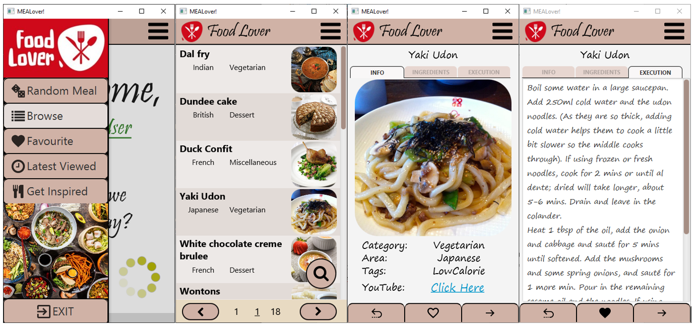
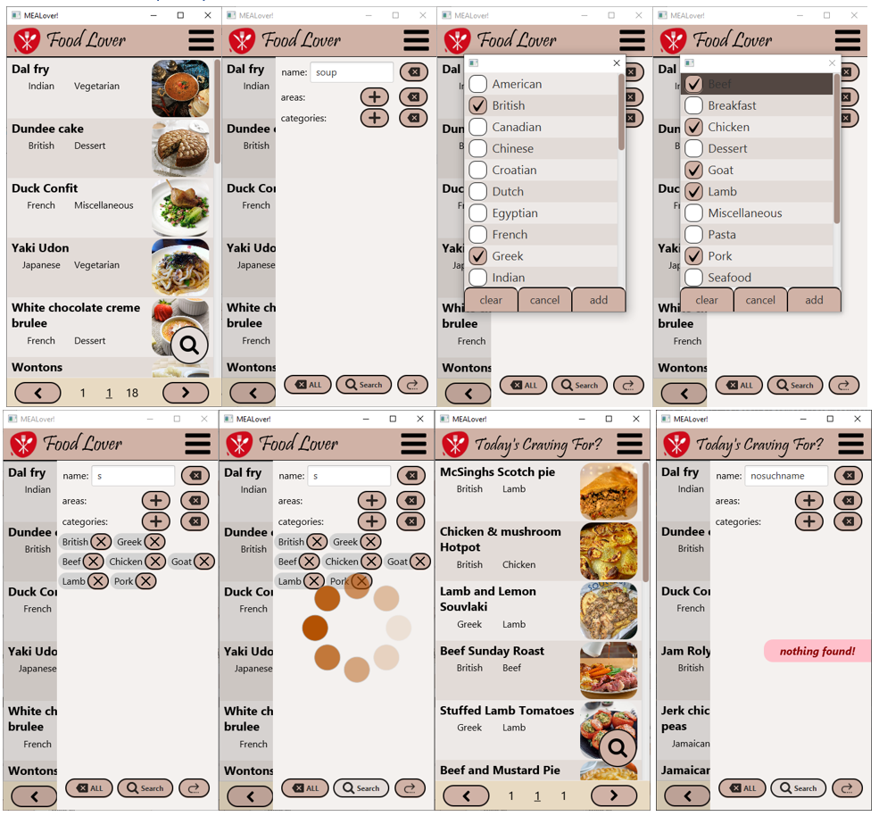
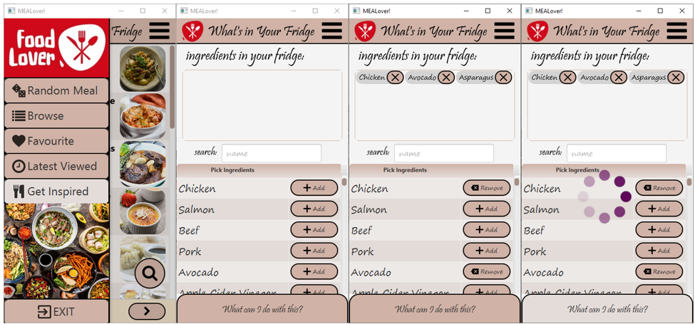

# Meal lover mobile app
JavaFX application with views as .FXML files for browsing and searching recipes (mainly for main
course dishes, soups and desserts). Source of recipes:
https://www.themealdb.com/api.php 

### More information:
UML diagrams and more precise information about technologies used can be found [here](https://1drv.ms/b/s!Apw2TbJ2OR6AkV-S3-zs2XBnmMSk?e=bq74fl)

### Screenshots:
browsing and filtering 

searching for recipe by ingredients
